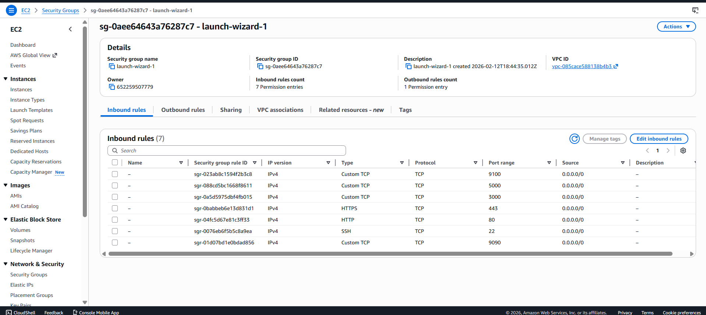
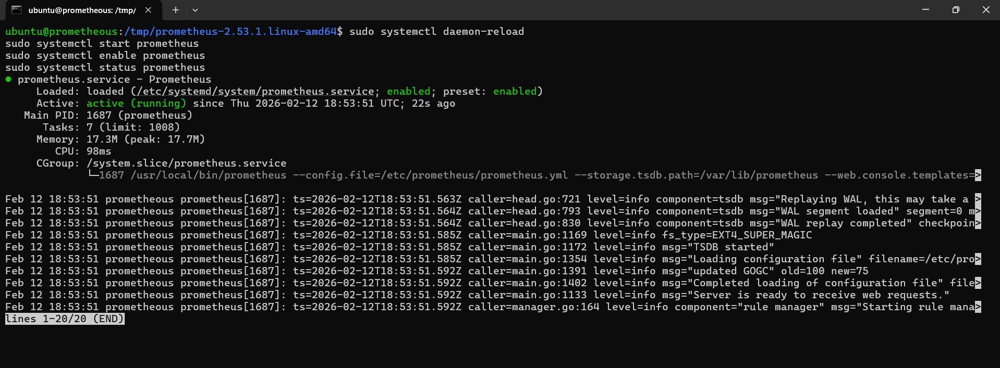
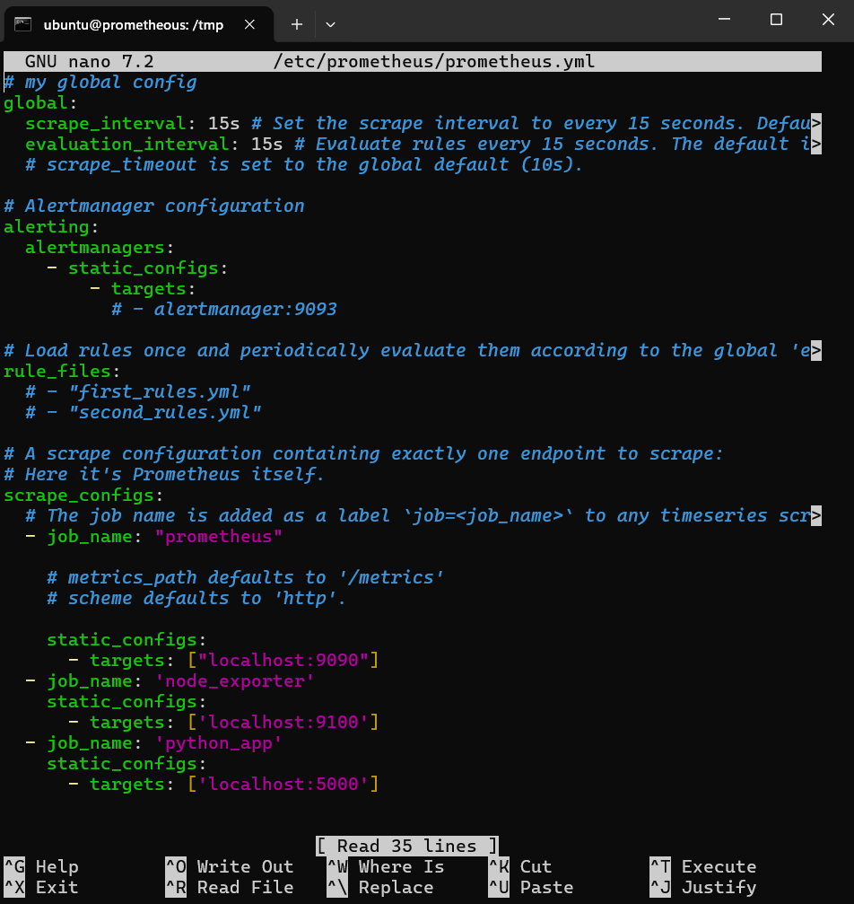
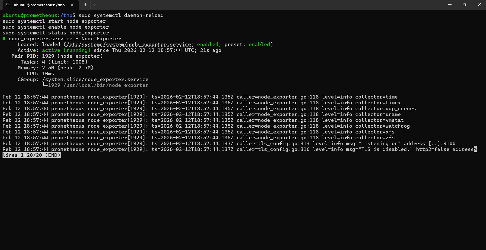
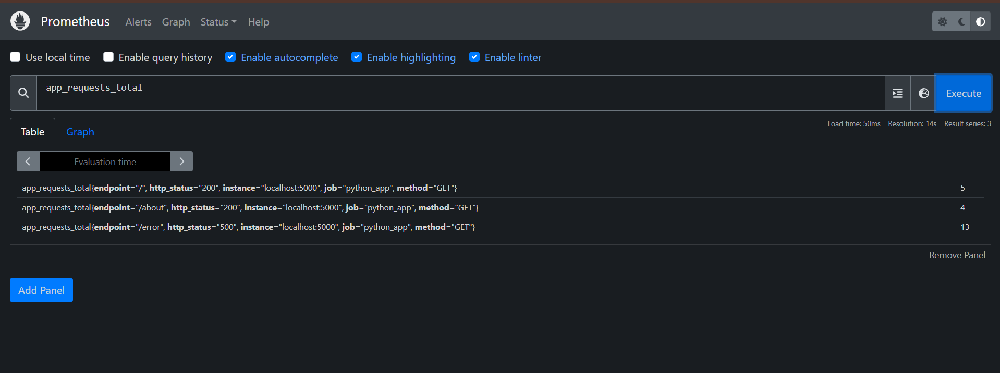
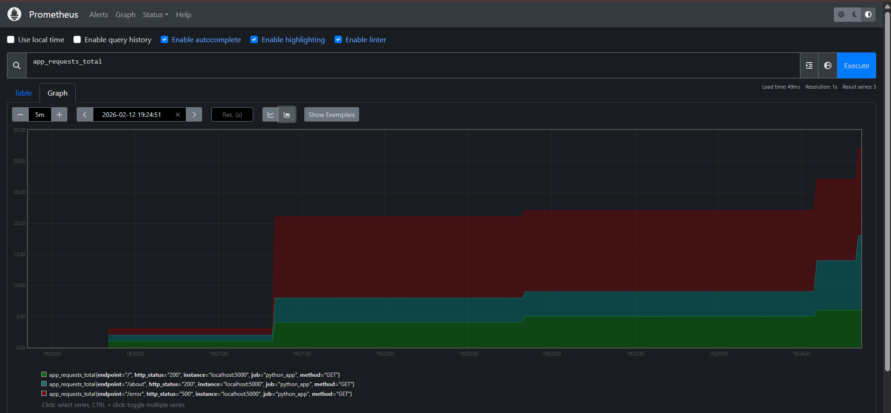
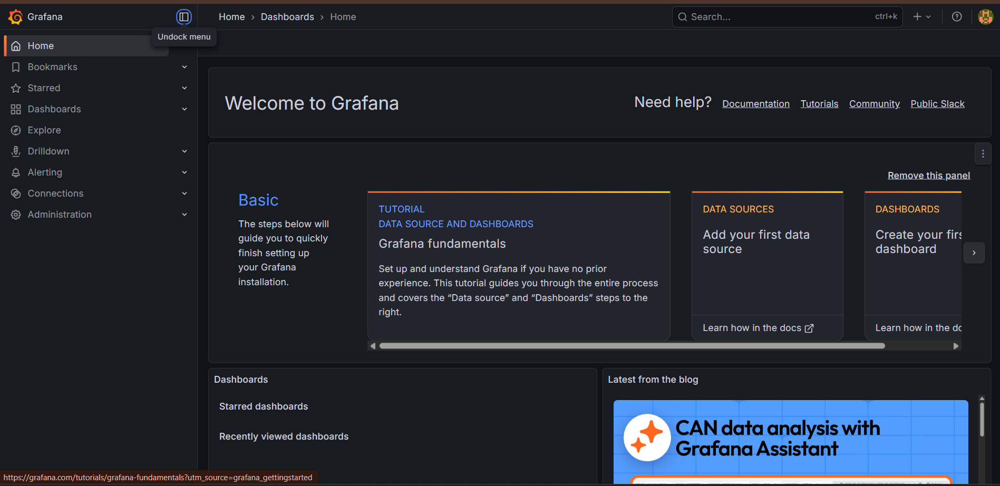
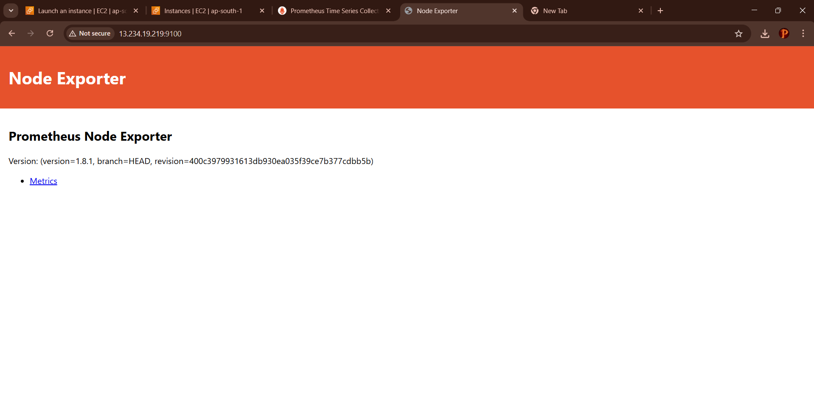

# Prometheus, Node Exporter and Grafana Monitoring Stack on AWS EC2

## Project Overview

This project demonstrates the deployment of a complete monitoring stack on AWS EC2 using:

* Prometheus
* Node Exporter
* Flask Application with custom metrics
* Grafana
* Linux systemd services

The system monitors both application-level and infrastructure-level metrics and provides visualization through Grafana dashboards.

---

## Architecture

User → Flask Application (Port 5000)
Flask exposes `/metrics` endpoint
Prometheus (Port 9090) scrapes:

* Flask application metrics
* Node Exporter system metrics

Grafana (Port 3000) connects to Prometheus and visualizes metrics via dashboards.

---

## Technology Stack

* AWS EC2 (t3.micro)
* Ubuntu 22.04 LTS
* Prometheus v2.53.1
* Node Exporter v1.8.1
* Python (Flask)
* Grafana
* Linux systemd

---

## AWS EC2 Setup

### Instance Configuration

* Instance Type: t3.micro
* OS: Ubuntu 22.04 LTS

### Security Group Inbound Rules

| Port | Purpose           |
| ---- | ----------------- |
| 22   | SSH               |
| 9090 | Prometheus        |
| 9100 | Node Exporter     |
| 5000 | Flask Application |
| 3000 | Grafana           |

Source: 0.0.0.0/0

---

## Prometheus Installation

### Create User and Directories

```bash
sudo useradd --no-create-home --shell /bin/false prometheus
sudo mkdir /etc/prometheus
sudo mkdir /var/lib/prometheus
sudo chown prometheus:prometheus /var/lib/prometheus
```

### Start Prometheus Service

```bash
sudo systemctl daemon-reload
sudo systemctl start prometheus
sudo systemctl enable prometheus
```

Access Prometheus:

```
http://YOUR_PUBLIC_IP:9090
```

---

## Node Exporter Installation

### Start Node Exporter Service

```bash
sudo systemctl daemon-reload
sudo systemctl start node_exporter
sudo systemctl enable node_exporter
```

Verify:

```
http://YOUR_PUBLIC_IP:9100
```

---

## Prometheus Configuration

Edit:

```
/etc/prometheus/prometheus.yml
```

Configuration:

```yaml
global:
  scrape_interval: 15s

scrape_configs:
  - job_name: 'prometheus'
    static_configs:
      - targets: ['localhost:9090']

  - job_name: 'node_exporter'
    static_configs:
      - targets: ['localhost:9100']

  - job_name: 'python_app'
    static_configs:
      - targets: ['localhost:5000']
```

Restart Prometheus:

```bash
sudo systemctl restart prometheus
```

---

## Flask Monitoring Application

### Install Dependencies

```bash
sudo apt install python3-pip python3-venv -y
python3 -m venv myenv
source myenv/bin/activate
pip install flask prometheus_client
```

### Run Application

```bash
nohup python3 app.py > app.log 2>&1 &
```

### Application Metrics

The Flask application exposes:

* `app_requests_total`
* `app_errors_total`
* `app_request_latency_seconds`

Example Prometheus query:

```
app_requests_total
```

---

## CPU Usage Monitoring

To calculate CPU usage percentage in Prometheus:

```
100 - (avg by (instance) (irate(node_cpu_seconds_total{mode="idle"}[5m])) * 100)
```

This formula subtracts idle CPU time from 100 to determine active CPU utilization.

---

## Grafana Installation

### Install Grafana

```bash
sudo apt-get install -y apt-transport-https software-properties-common wget

sudo mkdir -p /etc/apt/keyrings/

wget -q -O - https://apt.grafana.com/gpg.key | gpg --dearmor | sudo tee /etc/apt/keyrings/grafana.gpg > /dev/null

echo "deb [signed-by=/etc/apt/keyrings/grafana.gpg] https://apt.grafana.com stable main" | sudo tee /etc/apt/sources.list.d/grafana.list

sudo apt-get update
sudo apt-get install grafana -y

sudo systemctl start grafana-server
sudo systemctl enable grafana-server
```

Access Grafana:

```
http://YOUR_PUBLIC_IP:3000
```

Default credentials:

Username: admin
Password: admin

---

## Add Prometheus Data Source in Grafana

1. Login to Grafana
2. Navigate to Connections → Data Sources
3. Click Add Data Source
4. Select Prometheus
5. Set URL:

```
http://localhost:9090
```

6. Click Save & Test

After successful connection, create dashboards for:

* CPU usage
* Application request count
* Error rate
* Request latency

---

## Metrics Monitored

### Application Metrics

* app_requests_total
* app_errors_total
* app_request_latency_seconds

### Infrastructure Metrics

* node_cpu_seconds_total
* node_memory_MemAvailable_bytes
* node_filesystem_size_bytes

---

## Project Screenshots

### AWS Security Group



### Prometheus Service Running



### Prometheus Configuration File



### Node Exporter Running



### Application Metric (Table View)



### Application Metric (Graph View)



### Grafana Installation



### Prometheus Query Validation



---

## Repository Structure

```
prometheus-flask-monitoring/
│
├── app/
│   ├── app.py
│   └── requirements.txt
│
├── prometheus/
│   ├── prometheus.yml
│   ├── prometheus.service
│   └── node_exporter.service
│
├── scripts/
├── img/
└── README.md
```

---

## Skills Demonstrated

* AWS EC2 provisioning and configuration
* Linux server administration
* Prometheus setup and scrape configuration
* Node Exporter integration
* Custom application instrumentation
* Grafana dashboard configuration
* Infrastructure and application monitoring design

